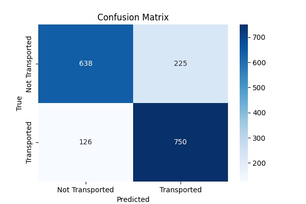

# XGBoost-Based-Space-Transport-Classification
This project implements an XGBoost-based machine learning model to predict whether a passenger was transported or not into another dimension. It includes data preprocessing, feature engineering, hyperparameter tuning, and model evaluation to achieve optimal performance. 

## Confusion Matrix:

## Classification Report:
||Precision |    Recall|  F1-score|   Support|
|-----|-----|-----|-----|-----|
|False|       0.83|      0.74|      0.78|      863|
|True   |0.77      |0.85      |0.81|       876|           
|Accuracy|                           ||0.79      |1739|
|Macro avg|       0.80     | 0.79|      0.79|      1739
weighted avg      | 0.80|      0.79|      0.79|      1739
